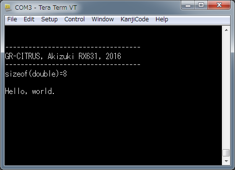
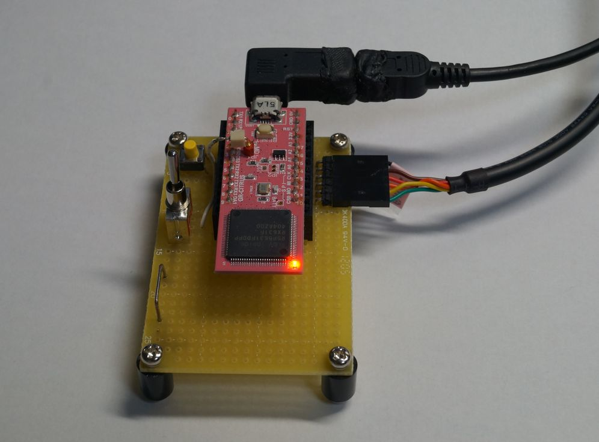

# A hello-world C program for RX631
A hello-world C program as a HEW project for Akizuki GR-CITRUS, RX631, board

------
# Functions
- TPU/ch0 generates interrupt every 1ms
- LED1 toggles with 1s period
- Serial TXD0 outputs text string with printf()
 - RXD0 is not used.
- DA1 outputs a sawtooth waveform of 1024ms period
- TP1 gets HIGH while running in the 1ms-interrupt function

# I/O

| IO nickname   | IO | Board pin    |
|:--|:--|:--|:--|
|TXD0  | SCI0 TXD   | CN1-1        |
|RXD0  | SCI0 RXD   | CN1-2        |
|LED1  | PortA/bit0 | mounted on board |
|TP1   | Port1/bit2 | CN1-3        |
|DA1   | DAC ch1    | CN1-12       |

------
# License: MIT License  
- See the [LICENSE.txt](LICENSE.txt) file for details.
