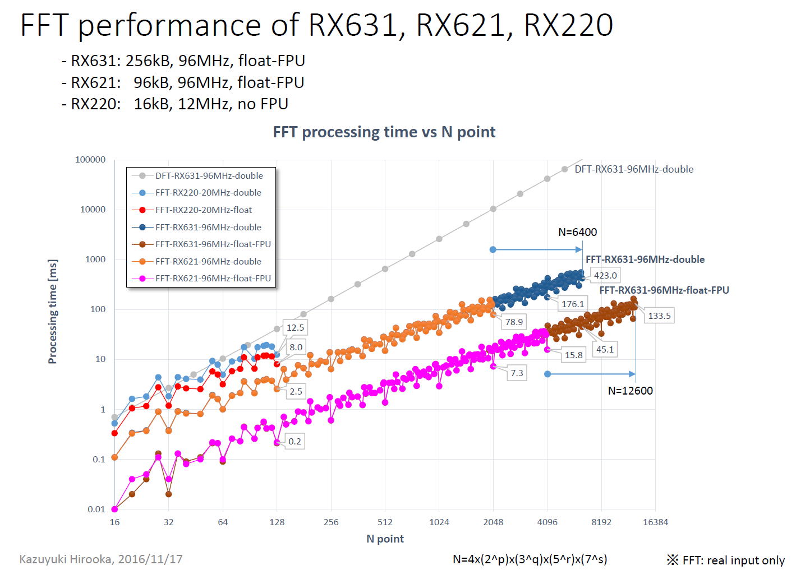

# rx631_sample
Small sample C program as a HEW project for Akizuki GR-CITRUS, RX631, board
------
# Functions
## DFT/FFT and self test
On power up, DFT and FFT functions are executed and processing time is shown via serial port.  
 - FFT function spec:  
  - Input:          real only  
  - Output:         0 to Nuquist frequency  
  - Precision:      double(8 or 4byte)  
    (Renesas tool HEW can handle double type as either 8 or 4 byte.)  
  - Number of input data supported: **N=4(2^p)(3^q)(5^r)(7^s)**  
    Åi4<=N<=6400 and p, q, r and s is an integer >= 0Åj  
    (N can be extended to 12600, if double is set to be handled as 4byte)
  - Desimation type: decimation-in-time  
  - Radix:          mixed radix  
      - intermediate stage: 8, 7, 5, 4, 3, 2  
      - terminal stage:     16, 8, 5, 4, 3, 2  
  - Implementation: recursively implemented:  
        a core function calls one of radix-specific functions depending on its input data count parameter M, and the called radix-specific function calls the core function to perform sub-M FFT.  

  - performance summary
    
    For further details, see [20161117_FFT_performance_RX631_RX621_RX220.pdf](20161117_FFT_performance_RX631_RX621_RX220.pdf) and [20160514_FFT_performance_RX621_RX220.pdf](20160514_FFT_performance_RX621_RX220.pdf).
 - For other RX621 or RX220 development board versions, see [https://github.com/radioshack16/rx621_sample](https://github.com/radioshack16/rx621_sample), or [https://github.com/radioshack16/rx220_sample](https://github.com/radioshack16/rx220_sample) projects.
------
# License: MIT License  
- See the [LICENSE.txt](LICENSE.txt) file for details.

-----
Blog : <http://solar-club.jp/member/radioshack16/>
-----

